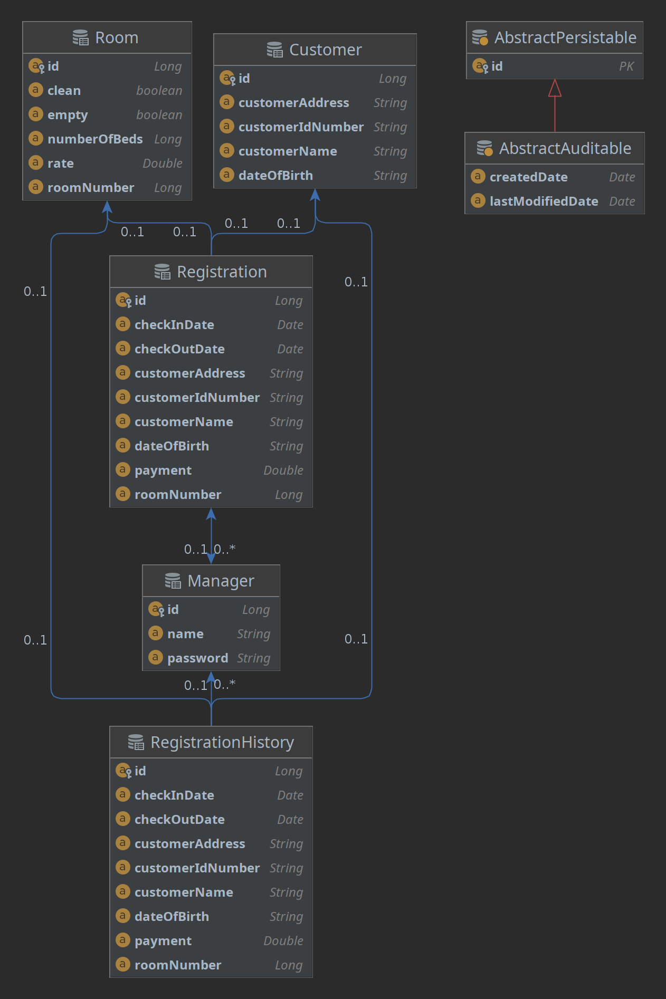
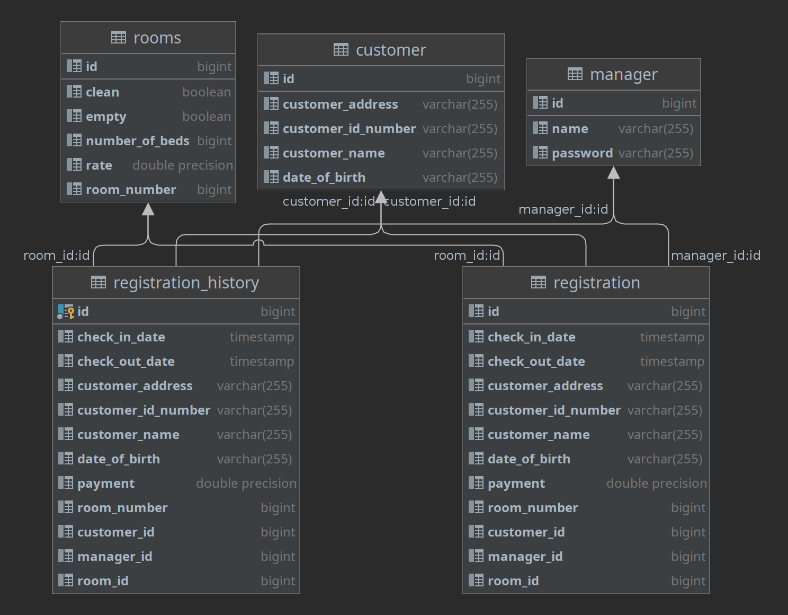

<h1 align="center"> Motel Registration API</h1>
<h3 align="center"> A simple api for registering guest created with SpringBoot, PostgreSQL, and Java.</h3>
<p align="center"> </p> 

## Table of Contents
* [User Stories](#User-Stories)
* [Tools Used](#Tools-Used)
* [Installation](#Installation)
* [POM Dependencies](#POM-Dependencies)
* [Entity Relationship Diagram (ERD)](#Entity-Relationship-Diagram)
* [Model View Controller System Design](#Model-View-Controller-System-Design)
* [API Endpoints](#Endpoints)
* [Database Layout](#Database-Layout)
* [Sample of Output](#Sample-of-Output)
* [Project File Structure](#Project-Structure)
* [Project Class Diagram](#Class-Diagram)


This project involved using IntellJ to develop a REST API for a motel/hotel registration database.
The API allows managers to check in customers into the system. The manager has full control over registration, customer records, and room records. 
The system is secure using spring security and JSON Web Token for authentication of the manager. 

When a registration is made for a new customer, the customer data is transferred to the customer records and the room is switched to occupied. 
As a manager you can make updates to each record as needed. The registration also has a few checks in place to make sure an occupied or unready room isn't rented.


### The Approach
I first started think form my own experience and imagining what I would like to see and what other managers would like to see in a registration application.
I made a list of user stories on features a manager would like to have in a registration application. I expanded the user stories from just the manager to also include an administrator and included stories of features an administrator might want.

Next I thought about the registration process and how it might look like, from that I came up with an initial entity relationship diagram showing how all the table would work together.
From the initial diagram I scaled back the scope of the project to just include the core components to start with. These components included the manager, the registration, the customer, and the room.

During the development of the registration application I kept referring to the user stories and the ERD to make sure I was staying on track and covering all the requirements.
I first started with making all the models for the entities in the project, then I made a service and controller for each on and tested each endpoint to verify it was working correctly.

After I had built out each entity with service and controller, I started on enabling Spring Boot security. I loaded in the necessary dependencies and started creating the classes that would be the logic of the security.
After testing the secured endpoints and the allowed endpoints I started with enabling JWT Web Tokens. After adding the dependencies in pom.xml I started
creating the classes required for enabling JWT Web Tokens. 

After I verified that the tokens were fully working I went back and started refining the logic for each endpoint and checking the functions and error handling. As I went through each method I added some functionality to some of them.
I also started trying to implement a PATCH request, which took some research and trial-and-error process to get working correctly. 

The core functionality was complete, so I started unit testing. I did some research and started implementing localized testing using h2 in-memory database. I also came across a way to do testing using containers, so 
I got Docker set up and Postgres installed and got the testing running. After I verified the in-memory and container databases were working I started creating tests for the other repositories to 
test whether they were writing to the database and receiving back the same data.


### Unsolved Problems or Major Hurdles

One of the major hurdles I faced was implementing the PATCH functionality. I tried to replicate the PUT method, but it was putting null values 
in any field that wasn't filled. I did some research but there wasn't many examples of PATCH and the ones that were there were using other dependencies
such as JSON Patch, which I didn't want to do because I knew Spring had PATCH implemented already. After some trying I found a way to get PATCH working
using if statements that check for null values in the request body. If a null is present then that field isn't updated. 

### Todo
- [ ] Add an administrator role and move functions like create manager, create rooms, delete rooms, etc. to this role.
- [ ] Add customer history and comments/notes table
- [ ] Add payment type to registration
- [ ] Add more integration and unit testing


## User Stories

   - [x] As a manager I would like to create a new customer through registration
   - [x] As a manager I would like to be able to log in
   - [x] As a manager I would like to check on the status of each room
   - [x] As a manager I would like to be able to update customer information
   - [x] As a manager I would like to view daily reports
   - [x] As a manager I would like to view monthly reports
   - [x] As a manager I would like to assign the customer a room
   - [x] As a manager I would to assign a customer a check in and check out date
   - [ ] As a manager I would like to check customer history
   - [ ] As a manager I would like to choose different payment type (cash or credit card)


   - [ ] As an admin I would full access to the system
   - [ ] As an admin I would like to be able to edit permissions
   - [ ] As an admin I would like to view system reports and logs


## Tools Used

|                                                                                 |                 |
|:-------------------------------------------------------------------------------:|:---------------:|
|      |   Spring Boot   |
|  |  IntelliJ IDEA  |
|                    |      Java       |
|                |  Apache Maven   |
|             |   PostgreSQL    |
|                   |     Postman     |
|          | testcontainers  |
|               |   Lucidcharts   |
|                          | Json Web Tokens |
|                     |     Docker      |


## Installation

- Install [PostgreSQL](https://www.postgresql.org/download/). Using the localhost with port 5432, create a database named motel_records.
- Update application-dev.properties with your username and password.
- To test endpoints use [Postman](https://www.postman.com/). You may import the Motel_Registration.postman_collection.json file that is in the repo into Postman to get all endpoints. [Token Setup Guide](https://i.imgur.com/HEvAKN1.png)
- For container testing, install [Docker](https://docs.docker.com/engine/install/). After docker is installed, you need to install the [Postgres docker image](https://hub.docker.com/_/postgres/).
- For container testing, update BaseContainerTest.java with the PostgreSQL username and password you set on installation.


## POM Dependencies
```xml
        <dependency>
            <groupId>io.jsonwebtoken</groupId>
            <artifactId>jjwt</artifactId>
            <version>0.9.1</version>
        </dependency>
         <dependency>
            <groupId>org.postgresql</groupId>
            <artifactId>postgresql</artifactId>
            <scope>runtime</scope>
        </dependency>
        <dependency>
            <groupId>org.junit.vintage</groupId>
            <artifactId>junit-vintage-engine</artifactId>
            <scope>test</scope>
            <exclusions>
                <exclusion>
                    <groupId>org.hamcrest</groupId>
                    <artifactId>hamcrest-core</artifactId>
                </exclusion>
            </exclusions>
        </dependency>
        <dependency>
            <groupId>org.testcontainers</groupId>
            <artifactId>postgresql</artifactId>
            <version>1.16.3</version>
            <scope>test</scope>
        </dependency>
         <dependency>
            <groupId>org.junit.jupiter</groupId>
            <artifactId>junit-jupiter</artifactId>
            <version>5.8.2</version>
            <scope>test</scope>
        </dependency>
        <dependency>
            <groupId>org.testcontainers</groupId>
            <artifactId>testcontainers</artifactId>
            <version>1.16.3</version>
            <scope>test</scope>
        </dependency>
        <dependency>
            <groupId>org.testcontainers</groupId>
            <artifactId>junit-jupiter</artifactId>
            <version>1.16.3</version>
            <scope>test</scope>
        </dependency>
        <dependency>
            <groupId>com.h2database</groupId>
            <artifactId>h2</artifactId>
        </dependency>
 ```

## Entity Relationship Diagram


### Initial ERD


### Project ERD




## Model View Controller System Design

This project uses MVC design principles. It consists of model, view, and controller classes to help with "separation of concerns". This project consists of:

- 7 Model Classes
- 5 Controller Classes
- 7 Service Classes
- 5 Repository Interfaces
- 22 API endpoints
  - 2 public
  - 20 with authorization


## Endpoints


| Request Type | URL                                        | Request Body                                                                                                 | Request Header             |
|--------------|:-------------------------------------------|:-------------------------------------------------------------------------------------------------------------|----------------------------|
| POST         | /auth/managers/register                    | name, password                                                                                               |                            |
| POST         | /auth/managers/login                       | name, password                                                                                               |                            |
| GET          | /api/registrations                         |                                                                                                              | Authorization Bearer TOKEN |
| GET          | /api/registrations/{room}                  |                                                                                                              | Authorization Bearer TOKEN |
| POST         | /api/registrations                         | customerName, customerIdNumber, dateOfBirth, customerAddress, payment, roomNumber, checkInDate, checkOutDate | Authorization Bearer TOKEN |
| PUT          | /api/registrations/{room}                  | customerName, customerIdNumber, dateOfBirth, customerAddress, payment, roomNumber, checkInDate, checkOutDate | Authorization Bearer TOKEN |
| PATCH        | /api/registrations/{room}                  | customerName, customerIdNumber, dateOfBirth, customerAddress, payment, roomNumber, checkInDate, checkOutDate | Authorization Bearer TOKEN |
| DELETE       | /api/registrations/{room}                  |                                                                                                              | Authorization Bearer TOKEN |
| GET          | /api/rooms                                 |                                                                                                              | Authorization Bearer TOKEN |
| GET          | /api/rooms/{roomId}                        |                                                                                                              | Authorization Bearer TOKEN |
| POST         | /api/rooms                                 | roomNumber, numberOfBeds, rate, clean, empty                                                                 | Authorization Bearer TOKEN |
| PUT          | /api/rooms/{roomId}                        | roomNumber, numberOfBeds, rate, clean, empty                                                                 | Authorization Bearer TOKEN |
| PATCH        | /api/rooms/{roomId}                        | roomNumber, numberOfBeds, rate, clean, empty                                                                 | Authorization Bearer TOKEN |
| DELETE       | /api/rooms/{roomId}                        |                                                                                                              | Authorization Bearer TOKEN |
| GET          | /api/customers                             |                                                                                                              | Authorization Bearer TOKEN |
| GET          | /api/customers/{customerId}                |                                                                                                              | Authorization Bearer TOKEN |
| POST         | /api/customers                             | customerName, customerIdNumber, dateOfBirth, customerAddress                                                 | Authorization Bearer TOKEN |
| PUT          | /api/customers/{customerId}                | customerName, customerIdNumber, dateOfBirth, customerAddress                                                 | Authorization Bearer TOKEN |
| PATCH        | /api/customers/{customerId}                | customerName, customerIdNumber, dateOfBirth, customerAddress                                                 | Authorization Bearer TOKEN |
| DELETE       | /api/customers/{customerId}                |                                                                                                              | Authorization Bearer TOKEN |
| GET          | /api/registration_history                  |                                                                                                              | Authorization Bearer TOKEN |
| GET          | /api/registration_history/{registrationId} |                                                                                                              | Authorization Bearer TOKEN |
| PATCH        | /api/registration_history/{registrationId} | customerName, customerIdNumber, dateOfBirth, customerAddress, payment, roomNumber, checkInDate, checkOutDate | Authorization Bearer TOKEN |


## Database Layout



## Sample of Output

```json
[
    {
        "id": 1,
        "customerName": "Daniel M. Barrett",
        "customerIdNumber": "282235201",
        "dateOfBirth": "3/5/1977",
        "customerAddress": "6 N Pleasantburg Dr, Greenville, SC 29608, USA",
        "payment": 105.15,
        "roomNumber": 5,
        "checkInDate": "02/03/2022",
        "checkOutDate": "02/05/2022"
    },
    {
        "id": 2,
        "customerName": "Test Eleven Smith",
        "customerIdNumber": "J5adafGF",
        "dateOfBirth": "12/15/1972",
        "customerAddress": "1235 Main Street, Jonson, Tx, 56354",
        "payment": 160.25,
        "roomNumber": 11,
        "checkInDate": "01/30/2022",
        "checkOutDate": "02/03/2022"
    },
    {
        "id": 3,
        "customerName": "Ricardo Barnes",
        "customerIdNumber": "B-652-572-220-245",
        "dateOfBirth": "12/28/1999",
        "customerAddress": "128 Central Avenue, Capitol Heights, MD 20743, USA",
        "payment": 75.0,
        "roomNumber": 2,
        "checkInDate": "02/03/2022",
        "checkOutDate": "02/13/2022"
    }
]
```
## Project Structure


```
├── HELP.md
├── images
│   ├── docker-logo.png
│   ├── duckduckgo-logo.png
│   ├── entityManagerFactory(EntityManagerFactoryBuilder).png
│   ├── ERD - Page 1.png
│   ├── intellij-idea-logo.png
│   ├── java-logo.png
│   ├── json-logo.png
│   ├── lucidcharts.png
│   ├── motel_registration_class_diagram.png
│   ├── postgresql-logo.png
│   ├── postman-logo.png
│   ├── spring-boot-logo.png
│   └── testcontainers.png
├── motel_registration.iml
├── Motel_Registration.postman_collection.json
├── mvnw
├── mvnw.cmd
├── pom.xml
├── README.md
├── src
│   ├── main
│   │   ├── java
│   │   │   └── com
│   │   │       └── motelreg
│   │   │           └── motel_registration
│   │   │               ├── controller
│   │   │               │   ├── CustomerController.java
│   │   │               │   ├── ManagerController.java
│   │   │               │   ├── RegistrationController.java
│   │   │               │   ├── RegistrationHistoryController.java
│   │   │               │   └── RoomController.java
│   │   │               ├── exceptions
│   │   │               │   ├── InformationExistsException.java
│   │   │               │   ├── InformationNotFoundException.java
│   │   │               │   └── NotReady.java
│   │   │               ├── model
│   │   │               │   ├── Customer.java
│   │   │               │   ├── Manager.java
│   │   │               │   ├── RegistrationHistory.java
│   │   │               │   ├── Registration.java
│   │   │               │   ├── Request
│   │   │               │   │   └── LoginRequest.java
│   │   │               │   ├── Response
│   │   │               │   │   └── LoginResponse.java
│   │   │               │   └── Room.java
│   │   │               ├── MotelRegistrationApplication.java
│   │   │               ├── repository
│   │   │               │   ├── CustomerRepository.java
│   │   │               │   ├── ManagerRepository.java
│   │   │               │   ├── RegistrationHistoryRepository.java
│   │   │               │   ├── RegistrationRepository.java
│   │   │               │   └── RoomRepository.java
│   │   │               ├── security
│   │   │               │   ├── MyUserDetails.java
│   │   │               │   ├── MyUserDetailsService.java
│   │   │               │   └── SecurityConfigurer.java
│   │   │               └── service
│   │   │                   ├── CustomerService.java
│   │   │                   ├── JwtRequestFilter.java
│   │   │                   ├── JWTUtils.java
│   │   │                   ├── ManagerService.java
│   │   │                   ├── RegistrationHistoryService.java
│   │   │                   ├── RegistrationService.java
│   │   │                   └── RoomService.java
│   │   └── resources
│   │       ├── application-dev.properties
│   │       ├── application.properties
│   │       ├── application-test.properties
│   │       └── test-customer-data.sql
│   └── test
│       └── java
│           └── com
│               └── motelreg
│                   └── motel_registration
│                       ├── containertests
│                       │   ├── BaseContainerTest.java
│                       │   ├── CustomerRepositoryContainerTest.java
│                       │   ├── ManagerRepositoryContainerTest.java
│                       │   ├── RegistrationHistoryRepositoryContainerTest.java
│                       │   ├── RegistrationRepositoryContainerTest.java
│                       │   └── RoomRepositoryContainerTest.java
│                       ├── CustomerRepositoryTest.java
│                       ├── ManagerRepositoryTest.java
│                       ├── MotelRegistrationApplicationTests.java
│                       ├── RegistrationHistoryRepositoryTest.java
│                       ├── RegistrationRepositoryTest.java
│                       └── RoomRepositoryTest.java
└── target
    ├── classes
    │   ├── application-dev.properties
    │   ├── application.properties
    │   ├── application-test.properties
    │   ├── com
    │   │   └── motelreg
    │   │       └── motel_registration
    │   │           ├── controller
    │   │           │   ├── CustomerController.class
    │   │           │   ├── ManagerController.class
    │   │           │   ├── RegistrationController.class
    │   │           │   ├── RegistrationHistoryController.class
    │   │           │   └── RoomController.class
    │   │           ├── exceptions
    │   │           │   ├── InformationExistsException.class
    │   │           │   ├── InformationNotFoundException.class
    │   │           │   └── NotReady.class
    │   │           ├── model
    │   │           │   ├── Customer.class
    │   │           │   ├── Manager.class
    │   │           │   ├── Registration.class
    │   │           │   ├── RegistrationHistory.class
    │   │           │   ├── Request
    │   │           │   │   └── LoginRequest.class
    │   │           │   ├── Response
    │   │           │   │   └── LoginResponse.class
    │   │           │   └── Room.class
    │   │           ├── MotelRegistrationApplication.class
    │   │           ├── repository
    │   │           │   ├── CustomerRepository.class
    │   │           │   ├── ManagerRepository.class
    │   │           │   ├── RegistrationHistoryRepository.class
    │   │           │   ├── RegistrationRepository.class
    │   │           │   └── RoomRepository.class
    │   │           ├── security
    │   │           │   ├── MyUserDetails.class
    │   │           │   ├── MyUserDetailsService.class
    │   │           │   └── SecurityConfigurer.class
    │   │           └── service
    │   │               ├── CustomerService.class
    │   │               ├── JwtRequestFilter.class
    │   │               ├── JWTUtils.class
    │   │               ├── ManagerService.class
    │   │               ├── RegistrationHistoryService.class
    │   │               ├── RegistrationService.class
    │   │               └── RoomService.class
    │   └── test-customer-data.sql
    ├── generated-sources
    │   └── annotations
    ├── generated-test-sources
    │   └── test-annotations
    └── test-classes
        └── com
            └── motelreg
                └── motel_registration
                    ├── containertests
                    │   ├── BaseContainerTest.class
                    │   ├── CustomerRepositoryContainerTest.class
                    │   ├── ManagerRepositoryContainerTest.class
                    │   ├── RegistrationHistoryRepositoryContainerTest.class
                    │   ├── RegistrationRepositoryContainerTest.class
                    │   └── RoomRepositoryContainerTest.class
                    ├── CustomerRepositoryTest.class
                    ├── ManagerRepositoryTest.class
                    ├── RegistrationHistoryRepositoryTest.class
                    ├── RegistrationRepositoryTest.class
                    └── RoomRepositoryTest.class

 ```

## Class Diagram


