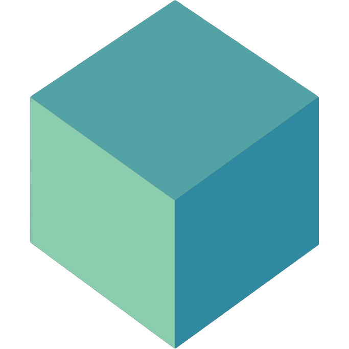
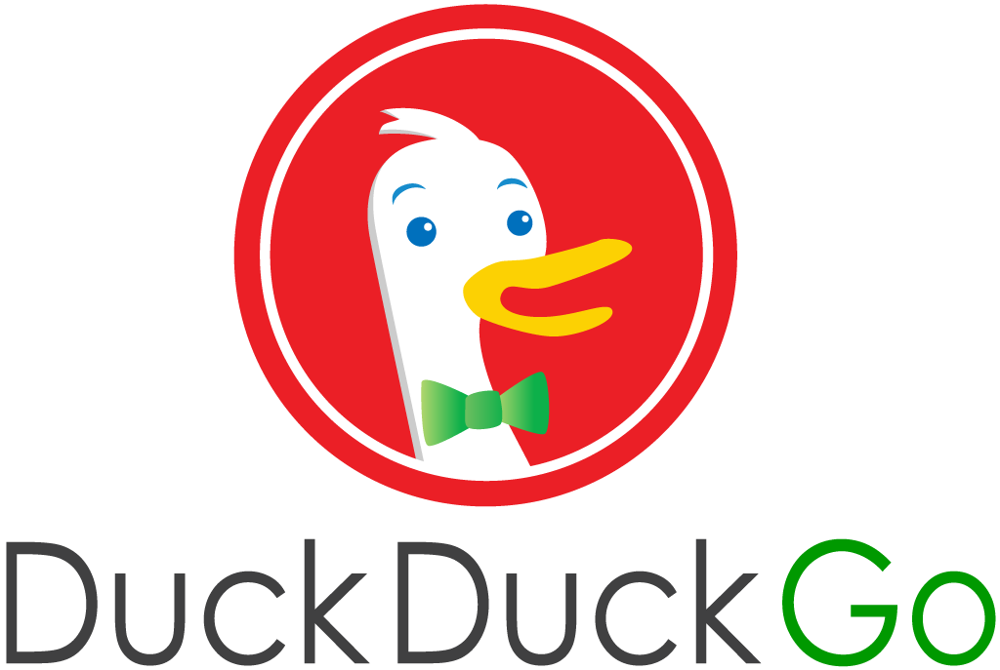

## System Tools Used

|                 |                              |
|-----------------|:-----------------------------|
| Spring Boot     | IntelliJ IDEA/Java 11 and 17 |
| Apache Maven    | PostgreSQL                   |
| Postman         | testcontainers               |
| Lucid App       | Duck Duck Go                 |
| Json Web Tokens | Docker                       |

## Endpoints

| ENDPOINT | FUNCTIONALITY                    | ACCESS |
| --- |:---------------------------------| :--- |
| POST _/api/register_ | Register a Manager               | PUBLIC |
| POST _/api/login_ | Log in as a Manager              | PUBLIC |
| GET _/admin/getusers_ | Get All Users                    | ADMIN |
| GET _/admin/getUser/{userId}_ | Get A User                       | ADMIN |
| POST _/admin/user/add_ | ADD A User                       | ADMIN |
| POST _/admin/role/add_ | ADD A Role                       | ADMIN |
| POST _/admin/adduserrole_ | ADD A Role to User               | ADMIN |
| GET _/admin/getsubmissions_ | Get All Submissions              | ADMIN |
| GET _/admin/pending_ | Get All Pending Submissions      | ADMIN |
| PUT _/admin/submissions_ | UPDATE A Submission              | ADMIN |
| DELETE _/admin/submissions_ | DELETE A Submission              | ADMIN |
| POST _/admin/createcategory_ | CREATE A Category                | ADMIN |
| GET _/admin/categories_ | GET ALL Categories               | ADMIN |
| GET _/admin/category/{categoryId}_ | GET A Category                   | ADMIN |
| PUT _/admin/categories/{categoryId}_ | UPDATE A Category                | ADMIN |
| DELETE _/admin/deletecategory_ | DELETE A Category                | ADMIN |
| GET _/admin/categories/{categoryId}/algorithms_ | GET ALL Algorithms in a Category | ADMIN |
| GET _/admin/categories/{categoryId}/algorithms/{algorithmId}_ | GET An Algorithm                 | ADMIN |
| POST _/admin/{categoryName}/createalgorithm_ | CREATE An Algorithm              | ADMIN |
| PUT _/admin/categories/{categoryId}/algorithms/{algorithmId}_ | UPDATE An Algorithm              | ADMIN |
| DELETE _/admin/deletealgorithm_ | DELETE An Algorithm              | ADMIN |
| POST _/users/{categoryName}/{algorithmName}/submit_ | CREATE A Submission              | USER |
| GET _/users/algorithms_ | GET All Algorithms               | USER |
| GET _/users/getsubmissions_ | GET All Submissions for User     | USER |

